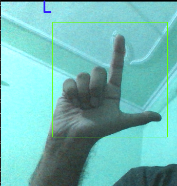
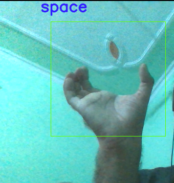
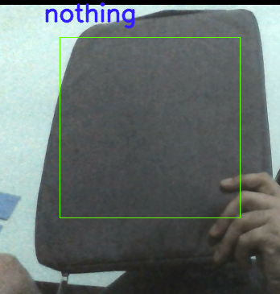

# Sign_Language_to_Alphabets

The project aims to predict sign language to english alphabets. We were able to get a number of right predictions.  
Dataset : [Dataset](https://www.kaggle.com/grassknoted/asl-alphabet)

 

